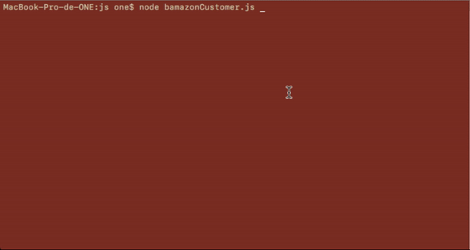

# AmazonClone
this program is in escence a sales managing system as such it serves three diferent kinds of user
customer, manager and supervisor

## bamazonCustomer.js
it presents the customer all the avaible products available then it updates its sales in the product database as well as loging the sale to a file.

- mysql.js (to connect to the mysql server).
- inquirer.js (for user interactive in the command line).
- moment.js (to add the time of the sale to the log).
- fs.js (to write to the log).

### normal function and log

### input handling 

## bamazon manager
it presens managar basic operations to observe and modify the avaible stock

- mysql.js (to connect to the mysql server).
- inquirer.js (for user interactive in the command line).
- cli-tables to create tables for the console

### normal function 

### input handling 

## bamazon SuperVisor
the supervisor allows you to see sales and overhead costs of the departments as a whole and add departments for the manager to put the products in

- mysql.js (to connect to the mysql server).
- inquirer.js (for user interactive in the command line).
- cli-tables to create tables for the console

### normal function 

### input handling 

